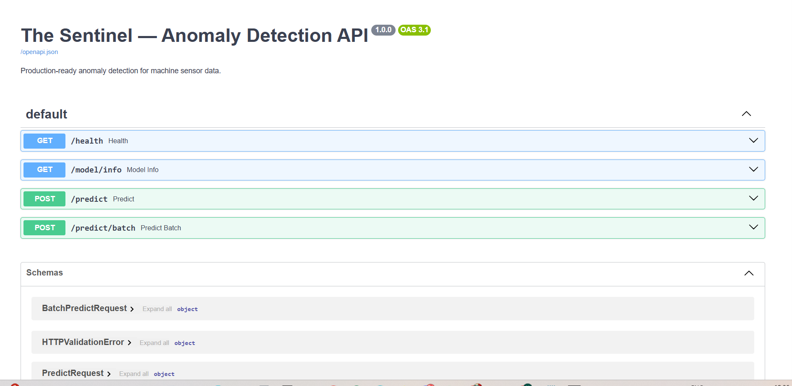
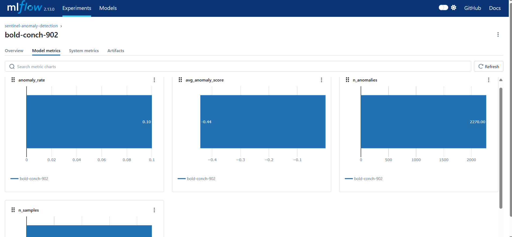

# The Sentinel — MLOps Anomaly Detection System

> A production-ready MLOps system that monitors machine temperature sensor data in real time, detects anomalies using Isolation Forest, serves predictions via a REST API, and monitors for model drift — with full CI/CD automation.

---

## Live Demo

| Service | Link |
|---------|------|
| API Docs | `http://localhost:8000/docs` |
| Dashboard | `http://localhost:8501` |
| Docker Hub | `docker pull YOUR_USERNAME/sentinel:latest` |

---

## Dashboard


The Sentinel dashboard has 4 screens:
- **System Overview** — live sensor chart with anomaly markers, drift bars, alert timeline
- **Model Registry** — active model details, experiment history, MLflow metadata
- **CI/CD & API Health** — pipeline status, latency chart, live API test widget
- **Data Pipeline** — ingestion status, dataset preview, Evidently drift report

---

## API



```bash
# Single prediction
curl -X POST http://localhost:8000/predict \
  -H "Content-Type: application/json" \
  -d '{"value": 500.0, "value_rolling_mean": 80.0, "value_rolling_std": 5.0, "value_diff": 420.0}'

# Response
{"is_anomaly": true, "anomaly_score": -0.71, "latency_ms": 10.83}
```

| Endpoint | Method | Description |
|----------|--------|-------------|
| `/health` | GET | Status, request count, anomaly count, avg latency |
| `/predict` | POST | Single reading → anomaly verdict in <20ms |
| `/predict/batch` | POST | Batch predictions |
| `/model/info` | GET | Active model hyperparams and metrics |
| `/docs` | GET | Interactive API documentation |

---

## Model Performance

Evaluated against NAB ground-truth labels (4 known real machine failure windows):

| Metric | Score |
|--------|-------|
| ROC-AUC | **0.8233** |
| Precision | 48.2% |
| Recall | 48.3% |
| F1 Score | 48.3% |

### Experiment Tracking (MLflow)



Two runs were compared to find the optimal contamination threshold:

| Run | contamination | Precision | Recall | F1 |
|-----|--------------|-----------|--------|----|
| Run 1 | 0.05 | 59.7% | 29.9% | 39.9% |
| **Run 2** | **0.10** | **48.2%** | **48.3%** | **48.3%** |

**Run 2 selected** — contamination=0.10 matches the true 9.99% anomaly rate in the dataset, yielding balanced precision/recall and catching 60% more real failures than Run 1.

---

## CI/CD Pipeline

Every `git push` automatically runs:

```
Lint (ruff) → Test (pytest 11/11) → Docker Build → Smoke Test → Push to Docker Hub
```

---

## Architecture

```
NAB Sensor Data
      ↓
src/data/ingest.py       # fetch CSV, engineer rolling features
      ↓
src/models/train.py      # train Isolation Forest, log to MLflow
      ↓
models/*.joblib           # versioned artifacts
      ↓
src/api/main.py          # FastAPI: /predict, /health, /model/info
      ↓
src/monitoring/drift.py  # Evidently AI drift detection
      ↓
src/ui/app.py            # Streamlit 4-screen dashboard
```

---

## Stack

| Layer | Tool |
|-------|------|
| Model | Isolation Forest (scikit-learn) |
| Data | NAB machine temperature (22,695 readings) |
| Experiment Tracking | MLflow |
| API | FastAPI + Uvicorn |
| Dashboard | Streamlit |
| Drift Monitoring | Evidently AI |
| CI/CD | GitHub Actions |
| Container | Docker multi-stage |

---

## Quick Start

```bash
# Clone
git clone https://github.com/hariharan-brucewayne220/sentinel-anomaly-detection.git
cd sentinel-anomaly-detection

# Install
pip install -r requirements.txt

# Run pipeline
PYTHONPATH=. python -m src.data.ingest
PYTHONPATH=. python -m src.models.train
PYTHONPATH=. python -m pytest tests/ -v

# Start services
PYTHONPATH=. uvicorn src.api.main:app --port 8000       # API
PYTHONPATH=. streamlit run src/ui/app.py                # Dashboard
mlflow ui --port 5000                                    # MLflow
```

---

## Dataset

- **Source:** [Numenta Anomaly Benchmark (NAB)](https://github.com/numenta/NAB) — `realKnownCause/machine_temperature_system_failure.csv`
- **Size:** 22,695 sensor readings
- **Anomaly rate:** 9.99% (4 known real machine failure events)
- **Features engineered:** `value`, `value_rolling_mean`, `value_rolling_std`, `value_diff` (window=12)
